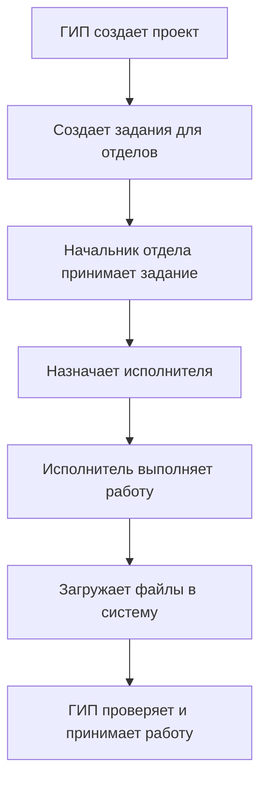

# 🏗️ Система управления проектами для архитектурно-строительных организаций

## 📋 Назначение системы

**Профессиональная система управления проектами, задачами и документооборотом для проектных институтов, архитектурных бюро и строительных компаний.**

---

## 🚀 Основные возможности

### 📁 **Управление проектами**
- Создание и ведение проектов зданий и сооружений
- Прикрепление технической документации (ТЗ, ТУ, графики, составы)
- Контроль сроков сдачи проектов
- Ведение реестра заказчиков и договоров
- Автоматическое создание структуры каталогов

### 📋 **Распределение и контроль заданий**
- Создание заданий от ГИП (Главного инженера проекта) для отделов
- Контроль сроков выполнения заданий
- Статусы: "Не принято" → "Принято" → "Выполнено"
- Цветовая индикация просроченных заданий

### 📎 **Управление файлами**
- Загрузка чертежей, расчетов, спецификаций
- Автоматическая сортировка по структуре:  
  `Проекты/Название_проекта/Задание/Отдел/Файлы`
- Автоматическое переименование файлов с датой
- Разделение файлов на "входящие" и "исходящие"

### 👥 **Ролевая модель доступа**

| Роль | Права доступа | Описание |
|------|---------------|----------|
| **0 - Администратор** | 🔧 Настройка системы, справочники | Полный доступ к настройкам |
| **1 - ГИП** | 📊 Создание проектов, выдача заданий | Руководство проектами |
| **2 - Начальник отдела** | 👨‍💼 Прием заданий, назначение исполнителей | Управление отделом |
| **3 - Исполнитель** | 📝 Выполнение заданий, загрузка файлов | Работа с конкретными заданиями |

---

## 🔄 Типичный рабочий процесс



## 🏢 Пример рабочего сценария

**Проект:** Жилой комплекс "Северный"

### Шаг 1: Создание проекта и заданий (ГИП)
- ГИП создает новый проект "Жилой комплекс 'Северный'"
- Устанавливает общий срок сдачи: 31.01.2024
- Создает задания для отделов:

**📋 Задание #1**
- **Отдел:** ООВТД (Основания и фундаменты)
- **Тема:** "Расчет свайного фундамента"
- **Срок:** 15.01.2024
- **Описание:** "Выполнить расчет свайного фундамента по ТУ №123"

**📋 Задание #2**
- **Отдел:** Архитектурный отдел
- **Тема:** "Разработка фасадов"
- **Срок:** 20.01.2024
- **Описание:** "Разработать варианты фасадов здания"

### Шаг 2: Прием задания (Начальник ООВТД)
- Начальник отдела ООВТД видит новое задание
- Принимает задание через интерфейс системы
- Назначает исполнителя: инженер Петров И.С.
- Система меняет статус задания на **"Принято"**

### Шаг 3: Выполнение работы (Инженер)
- Инженер Петров выполняет расчеты
- Загружает файлы в систему:

**📁 Загруженные файлы:**
- Расчет_свай_фундамента.dwg
- Спецификация_материалов.xls
- Пояснительная_записка.docx

**Файлы автоматически сохраняются в:**
`Проекты/Жилой_комплекс_Северный/Задание_ООВТД_фундамент/ООВТД/`

### Шаг 4: Контроль выполнения (ГИП)
- ГИП проверяет выполненные работы
- Оставляет комментарии/рецензию
- Принимает работу или отправляет на доработку
- При приемке система меняет статус на **"Выполнено"**

---

## 🎨 Интерфейс и визуализация

### Цветовая индикация статусов

| Статус | Цвет | Иконка | Описание |
|--------|------|--------|----------|
| **Выполнено** | `#00FF00` | 🟢 | Все работы завершены |
| **В работе** | `#B9B9FF` | 🔵 | Задание принято, идет работа |
| **Просрочено** | `#FFD988` | 🟡 | Срок выполнения истек |
| **Не принято** | `#FFFFFF` | ⚪ | Задание ожидает принятия |

### Структура пользовательского интерфейса
``` txt
Главное окно программы
├── 📊 Вкладка "Проекты"
│ ├── Список всех проектов
│ ├── Фильтры по статусу
│ ├── Кнопки: Новый проект, Открыть, Удалить
│ └── Цветовая индикация срочности
│
├── 📋 Вкладка "Задания"
│ ├── Задания выбранного проекта
│ ├── Сортировка по отделам/срокам
│ ├── Статусы: Принял/Выполнил
│ └── Интеграция с файлами
│
└── 📎 Вкладка "Файлы"
├── Файлы выбранного задания
├── Превью файлов
├── Кнопки: Загрузить, Скачать, Удалить
└── Информация об авторе файла
```
---

## 💾 Технические особенности

### Архитектура базы данных

**Основные таблицы системы:**

**ProjectsTbl (Проекты)**
- Id_Project (PK)
- ProjectName
- DateRealization (срок сдачи)
- RF_GIP (ссылка на ГИП)
- TZ_File, TU_File (техническая документация)

**TasksTbl (Задания)**
- Id_Task (PK)
- TaskName
- RF_Project (FK → ProjectsTbl)
- RF_Otdel (отдел-исполнитель)
- RF_Workman (исполнитель)
- DateRealization (срок)
- Prinjal (принято)
- Gotovo (выполнено)

**FilesTbl (Файлы)**
- Id_File (PK)
- FileName
- RF_Task (FK → TasksTbl)
- Ispolnitelyu (направление: входящий/исходящий)
- FileView (отображаемое имя)

---

## 🛠️ Технологический стек

| Компонент | Технология | Назначение |
|-----------|------------|------------|
| **Язык программирования** | Delphi/Object Pascal | Основная разработка |
| **GUI Framework** | VCL (Visual Component Library) | Пользовательский интерфейс |
| **База данных** | ADO (ActiveX Data Objects) | Работа с данными |
| **Хранилище файлов** | Windows File System | Хранение документов |
| **Конфигурация** | INI-файлы | Настройки программы |
| **Диалоги** | Windows API | Файловые диалоги, сообщения |

### Ключевые модули системы
``` txt
├── Basic_Unit.pas # Главная форма
├── Data_Unit.pas # Модуль базы данных
├── Types_Unit.pas # Общие типы и утилиты
├── Identification_Unit.pas # Авторизация
├── NewProject_Unit.pas # Управление проектами
├── NewTask_Unit.pas # Управление заданиями
├── Files_Unit.pas # Работа с файлами
├── Admin_Unit.pas # Административный интерфейс
├── Settings_Unit.pas # Настройки программы
├── Copy_Unit.pas # Копирование файлов
└── PasswordChange_Unit.pas # Смена пароля
```

---

## 📈 Бизнес-преимущества системы

### Для руководства
1. **Централизованный контроль** всех проектов и заданий
2. **Прозрачность сроков** и ответственности
3. **Автоматическая отчетность** по статусам выполнения
4. **Контроль качества** через систему рецензий

### Для сотрудников
1. **Четкое понимание задач** и сроков
2. **Удобный обмен документами** между отделами
3. **Автоматическое резервирование** версий файлов
4. **История изменений** для каждого проекта

### Для организации
1. **Стандартизация процессов** документооборота
2. **Снижение рисков** просрочек и ошибок
3. **Повышение эффективности** работы отделов
4. **Архивация проектов** в структурированном виде

---

## 🎯 Целевая аудитория

### ✅ Проектные организации
- Архитектурные бюро
- Проектные институты
- Дизайн-студии
- Инженерные компании

### ✅ Строительные компании
- Застройщики жилой недвижимости
- Промышленное строительство
- Генподрядные организации

### ✅ Государственные учреждения
- Управления архитектуры
- Экспертные организации
- Надзорные органы

### ✅ Корпоративные пользователи
- Проектные отделы предприятий
- Службы главного инженера
- Отделы капитального строительства

---

## 🔧 Системные требования

### Минимальные требования
- **Операционная система:** Windows 7 / 8 / 10 / 11
- **Процессор:** 1 ГГц или выше
- **Оперативная память:** 512 МБ (рекомендуется 1 ГБ)
- **Свободное место на диске:** 100 МБ + место под проекты
- **Разрешение экрана:** 1024×768

### Рекомендуемые требования
- **Операционная система:** Windows 10 / 11
- **Процессор:** 2 ГГц, 2 ядра
- **Оперативная память:** 2 ГБ и более
- **Свободное место на диске:** 1 ГБ + место под проекты
- **Сетевое подключение:** Для работы с сетевой БД

### Требования к базе данных
``` txt
Локальный вариант:
├── Microsoft Access (текущий вариант) (.mdb, .accdb)
└── SQLite (через ADO-драйвер)

Сетевой вариант:
├── Microsoft SQL Server
├── MySQL
├── PostgreSQL
└── Любая БД с поддержкой ADO
```
